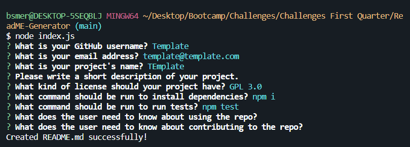

# README File Generator
## Description
Once the application starts, the user will be prompted with questions that are relevant to their structure and content of the README file they are wanting to create for their repo. The questions will be asked through the command line using Node.JS. A README file will be generated within their folder.

## Demonstration
Follow this link for a video demonstration: [https://drive.google.com/file/d/1EuQuHXA-1whJwjeJi644p5tQqawym99Z/view](https://drive.google.com/file/d/1EuQuHXA-1whJwjeJi644p5tQqawym99Z/view)

## Functionality
### Inquirer
Once the application has started, the user will be prompter with some questions in regards to the README file content. The questions will require answers in the form of text input, list selection or no response (with default choice). These prompts are created by importing the dependency inquirer@8.2.4 version in the command line.

### License
When the user is prompted with what license they are using, they can select to have no license. This invokes a series of functions that will determine if the user chose a specific license or no license at all. This causes the algorithm to make sure the README file will print with the specific license chosen or without any license.

### NPM
A couple of questions are asking for what specific command line prompts will be used to help install the data in their repository. The user is prompted to type what they want but they can leave it empty, which will refer to the default selections of "npm i" and "npm start", which work fine.

### README
Once the questions have been answered, the README file will be generated matching the select criteria within their folder chosen. The user can then continue to manually add to it within their own IDE.

## Sample README
Please find attached in the repository the sample README file for a sample repository. It is titled: README_SAMPLE.md

## GitHub Repository
[https://github.com/TheBigBookMan/ReadME-Generator](https://github.com/TheBigBookMan/ReadME-Generator)